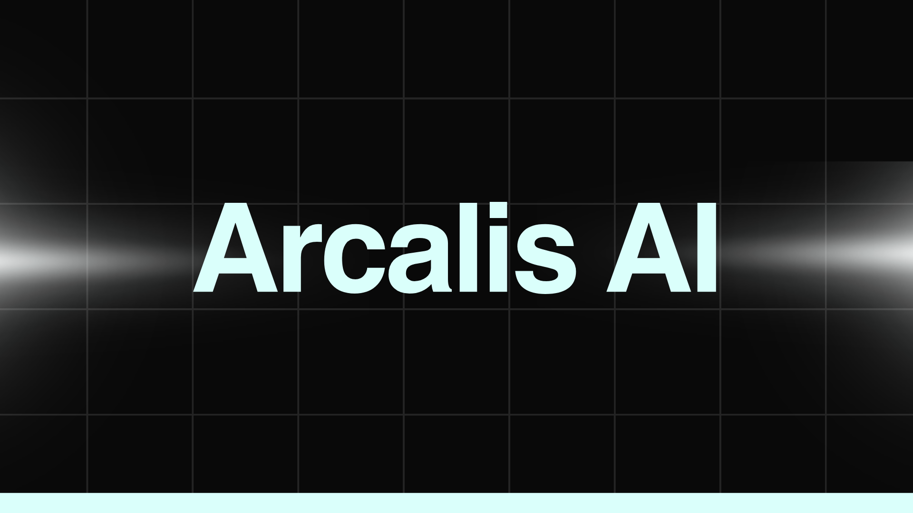

# Arcalis - A Decentralized AI Platform

Arcalis is a groundbreaking decentralized platform where users can interact with an **AI-powered chatbot** and actively engage in governance through a **Decentralized Autonomous Organization (DAO)**. Built on **blockchain technology**, Arcalis ensures secure and transparent transactions powered by cryptocurrency. The platform also integrates a unique **tiered subscription model** that grants access to various levels of service, along with voting and proposal features, enabling users to shape the future of the platform.

## Features of Arcalis

### AI-Powered Chatbot

At the heart of Arcalis lies an **advanced AI chatbot**, designed to assist users with a variety of tasks, from answering questions to engaging in meaningful conversations. The chatbot serves as the primary interface for users, with each subscription tier unlocking different levels of sophistication and functionality.

### Subscription Packages

Arcalis offers a flexible subscription model with **four distinct packages**, each unlocking unique features and capabilities of the AI model. The higher the subscription level, the more powerful and personalized the AI interactions become, tailored to each user's needs.

- **Celestium (Free Package):**  
  Access to the AI chatbot with basic functionalities. No customization options or DAO interaction.
  
- **Arcana (Level 2):**  
  Unlock advanced features, including specific responses and DAO voting rights for community proposals.

- **Aether (Level 3):**  
  Enjoy personalized recommendations, extended conversations, and the ability to create and vote on governance proposals.

- **Dominion (Level 4):**  
  Get the most powerful AI model with premium support, highly personalized interactions, and the highest voting power in governance.

## DAO Governance: Community-Driven Decisions

Arcalis operates on a **decentralized governance model**, where every user has a voice in shaping the platform's future. Through the DAO, members can propose new features, vote on changes, and directly influence the platform's growth.

- **Proposal System:**  
  All users can submit proposals for new features or changes. The proposals are voted on by the community, and voting power is determined by subscription levels, ensuring greater influence for higher-tier members.

## How Arcalis Works

### Cryptocurrency-Powered Subscription

Arcalis utilizes **cryptocurrency** for transactions, ensuring secure and transparent financial interactions. Subscription fees are paid in **Ether**, enabling decentralized financial transactions without intermediaries.

### Tiered Subscription System

Each level offers increasing access to more sophisticated AI features, providing users with a more tailored and powerful chatbot experience. 

### Voting and Proposal Participation

Arcalis empowers users to shape the platform by **creating**, **voting on**, and **influencing** decisions made on the platform based on their subscription level.

## Sustainable Impact and Social Development in Arcalis

Arcalis is not just about **AI interactions** and **decentralized governance**; it's about creating real-world impact through the **Shared Impact Fund**. Every transaction made by users contributes to both personal development and social causes.

### The Shared Impact Fund: Fueling Collective Good

A portion of each transaction is automatically allocated to the **Shared Impact Fund**, managed by the Arcalis DAO. This fund supports social, charitable, and community development initiatives.

#### How the Fund is Used:

- **Social Impact & Charitable Projects:**  
  Supporting social, educational, and charitable initiatives that empower communities and provide aid where it's needed.

- **Community Development:**  
  Strengthening the Arcalis community through events, workshops, and educational initiatives about blockchain and DAO principles.

- **Platform Innovation & Growth:**  
  Funding the development of new features and improvements to keep Arcalis cutting-edge.

### Transparency and Fund Allocation Policies

All fund usage is **managed through the DAO voting system**, ensuring **full transparency**. The community decides how funds should be allocated, and votes are cast on proposals.

#### How the Fund System Works:

- **Transaction Percentage:**  
  A small percentage (e.g., 5%) is deducted from each transaction and stored in the Shared Impact Fund. This percentage can be adjusted based on DAO decisions.

- **DAO Management:**  
  The DAO manages the fund and makes allocation decisions based on community votes.

- **Consensus-Based Decisions:**  
  Proposals for fund allocation are decided by community consensus, ensuring fairness and transparency.

- **Financial Transparency:**  
  All transactions involving the Shared Impact Fund are recorded on the blockchain for transparency and accountability.

## Building a Future Together

Arcalis isn’t just about AI—it’s a platform that **drives positive change** through decentralized governance. Every action you take contributes to the **greater good**, both for personal growth and for the betterment of the community and society.

### Join Arcalis Today!

Be a part of something bigger. Whether you’re exploring AI or contributing to social change, Arcalis offers a unique platform where **every action counts**.

## Final Thoughts

By combining **cutting-edge technology** with **real-world impact**, Arcalis transcends the boundaries of traditional platforms. The **Shared Impact Fund** exemplifies how decentralized systems can drive both innovation and social good.

**Together, we can build a sustainable and impactful future.** 🌍
