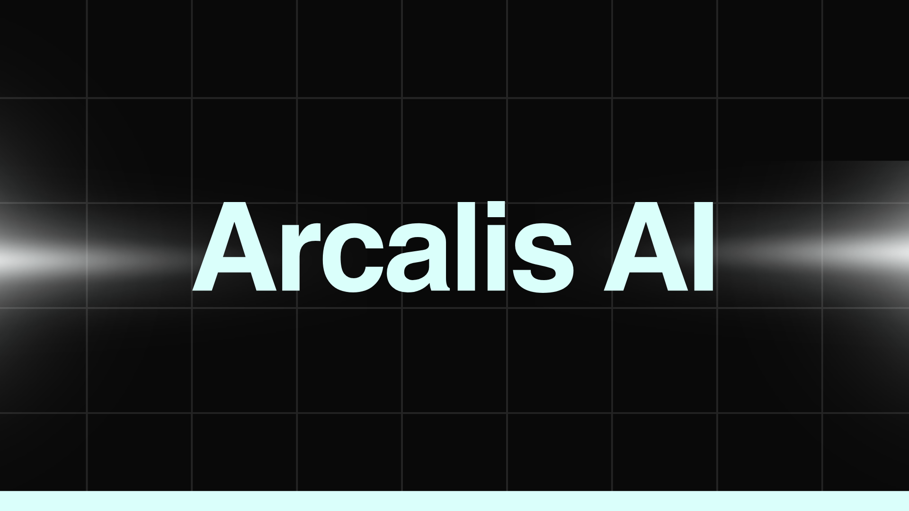

# 🚀 Arcalis - Decentralized AI Powerhouse  
  
[](https://opensource.org/licenses/MIT)
[](https://manta.network)
[](https://discord.gg/arcalis)

**The World's First Privacy-First AI Ecosystem**  
*Where Cutting-edge AI Meets Community Governance*  

---

## 🌟 Why Arcalis?  

<div align="center">
  
|                      | Arcalis               | Traditional AI        |
|----------------------|-----------------------|-----------------------|
| **Governance**       | 🗳️ Community-Driven  | 🏢 Corporate-Controlled |
| **Privacy**          | 🔒 ZK-Proof Protected | 📊 Data Monetized     |
| **Model Diversity**  | 🧠 6+ Integrated Models | 1-2 Fixed Models      |
| **Sustainability**   | 🌱 Carbon Neutral     | 🏭 High Energy Cost   |

</div>

---

## 🛠 Core Features  

### 🤖 Multi-AI Orchestration  
  
**Auto-Select the Perfect Model**  
```python
# Smart Model Routing Example
def select_model(task):
    if task.type == "multimodal":
        return Gemini_2_0
    elif task.priority == "security":
        return Microsoft_Phi_4
    else:
        return cost_optimizer(task)
```

**Supported AI Models**  
| Model              | Specialization         | Speed   | Accuracy |
|--------------------|------------------------|---------|----------|
| DeepSeek R1        | Big Data NLP           | 12K t/s | 92%      |
| Gemini 2.0         | Text+Image Reasoning   | 8.5K t/s| 95%      |
| Microsoft Phi-4    | Enterprise Security    | 6.2K t/s| 96%      |
| *[See All Models →](MODELS.md)* | | | 

---

### 🗳️ Next-Gen DAO Governance  
  
**Power to the People**  
- 🧮 Quadratic Voting: `√(Tier) + log(Activity Days)`  
- 🚨 Emergency Proposals: Bypass bureaucracy  
- 🔍 Full Transparency: On-chain decision records  

```solidity
// Governance Smart Contract Snippet
function createEmergencyProposal(
    string memory title, 
    uint duration
) public onlyOwner {
    require(duration >= 1 hours, "Minimum 1 hour");
    // ... emergency logic ...
}
```

---

### 💎 Tiered Access System  

| Tier        | 🎚️ Model Access      | 🗳️ Voting Power | ✨ Premium Features      |
|-------------|-----------------------|-----------------|--------------------------|
| **Explorer**| Basic Models          | -               | Community Forum Access   |
| **Scholar** | + Qwen Turbo          | +1              | Proposal Voting          |
| **Innovator**| Full Model Suite     | +2              | AI Training Sessions     |
| **Visionary**| Unlimited Priority   | +3              | 24/7 Enterprise Support  |

---

### 🌍 Shared Impact Fund  
  
**10% of All Transactions Fund**  
- 🎓 AI Education Grants  
- 🌳 Carbon Removal Projects  
- 🔬 Open Source Research  
*"See [2024 Impact Report →](IMPACT.md)"*

---

## ⚙️ Tech Stack  

### 🛡️ Manta Network Integration  
  
- **Zero-Knowledge Proofs** for private AI interactions  
- **200+ TPS** enterprise-grade throughput  
- **0.001$ Fees** - 90% cheaper than Ethereum  

### 🌱 Eco-Friendly Infrastructure  
- ♻️ Proof-of-Stake Consensus  
- 🌍 Carbon Offsets via KlimaDAO  
- 📉 50x Energy Efficiency vs Traditional AI  

---

## 🚀 Getting Started  

### Prerequisites  
- Node.js v18+  
- MetaMask Wallet  
- OpenRouter API Key  

### Installation  
```bash
git clone https://github.com/arcalis/arcalis-core.git
cd arcalis-core
npm install
cp .env.example .env  # Configure Manta RPC & API keys
```

### Launch Development  
```bash
npm run dev
# Visit http://localhost:3000
```

---

## 🤝 Contribute to the Future of AI  

We welcome:  
- 🧠 AI Model Integrations  
- 🔒 Security Audits  
- 🌐 Localization Efforts  
- 📚 Documentation Improvements  

*See our [Contribution Guide →](CONTRIBUTING.md)*  

---

## 📜 License  
This project is licensed under the MIT License - see the [LICENSE](LICENSE) file for details.

---

<div align="center">
  
[🌐 Official Website](https://arcalis.ai) | 
[📚 Documentation](https://docs.arcalis.ai) | 
[🐦 Twitter](https://twitter.com/arcalis_ai) | 
[💬 Discord](https://discord.gg/arcalis)

</div>

